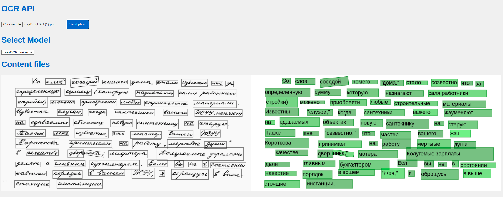

# OCR Factory

    


 

## What is it?
OCR Factory is a modular project that can be integrated with other projects requiring a OCR model. The server-side implementation is built on FastAPI. If needed, the project can be used independently by accessing the root page of the deployed project. 

The project incorporates Tesseract and EasyOCR models, including both their default configurations and versions trained specifically for Cyrillic text recognition.




# Table of contents

```bash
├── dockerfile                      # Dockerfile for creating Docker container
├── docs/                           # Directory for documentation and design files
│   └── index.html                  # Main HTML documentation file
│   
├── Makefile                        # Makefile for project automation
├── README.md                       # Project description and instructions
├── requirements.txt                # Python dependencies list for pip
└── src/                            # Source code directory
    ├── ai_models/                  
    │   ├── ocr_models/             # Directory for OCR model scripts
    │   │   ├── easyocr.py          
    │   │   ├── easyocr_trained.py   
    │   │   ├── ocr_interface.py    # Interface script for OCR models
    │   │   ├── pytesseract.py      
    │   │   ├── pytesseract_trained.py  
    ├── api/                        # Directory for API scripts
    │   ├── app/                    
    │   │   ├── crud.py             # Base funcstions 
    │   │   ├── endpoint.py         # API endpoints
    │   │   ├── middleware.py       # Middleware 
    │   │   ├── models.py           # Fast API models 
    │   └── main.py                 # Main API script
    ├── data/                       # Directory for data files
    ├── env.py                      # Environment configuration script
    ├── main.py                     # Main script for project execution
    ├── test.ipynb                  # Jupyter notebook for testing purposes
    └── utils/                      # Directory for utility scripts
        ├── build_features.py       # Script for building features
        ├── extract_features.py     # Script for extracting features
        └── visualize.py            # Script for visualizing data

```

# Installation
To install all dependencies and run locally 

```python
make build
cd src
python3 main.py
```

Or you can run a docker container
```bash
docker run -p your_port:8000 dimkablin/ocr_factory
```

Replace ```your_port``` with the port number on which you intend to run the container.

# API Endpoints

| Endpoint                  | Description                                      |
|---------------------------|--------------------------------------------------|
| `/`                       | Return a greeting site.                          |
| `/get-model-names/`       | Return a list of model names.                    |
| `/get-current-model/`     | Return the name of the current model.            |
| `/ocr/`                   | Predict function.                                |
| `/change-model/`          | Change the model.                                |


# Contact

Feel free to open an issue or submit a pull request.
